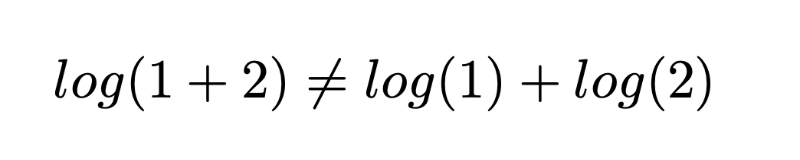
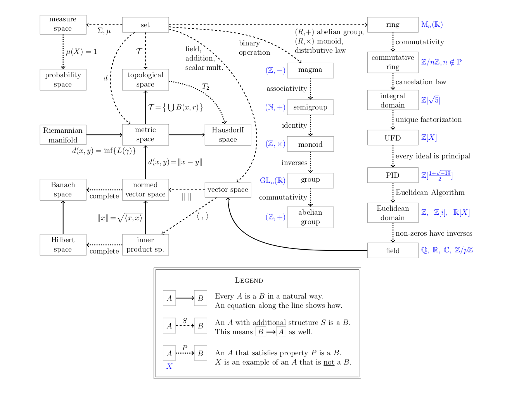
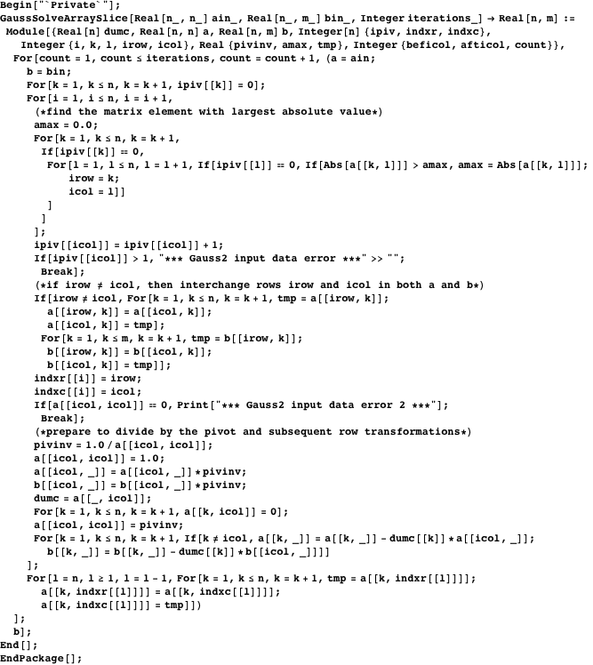
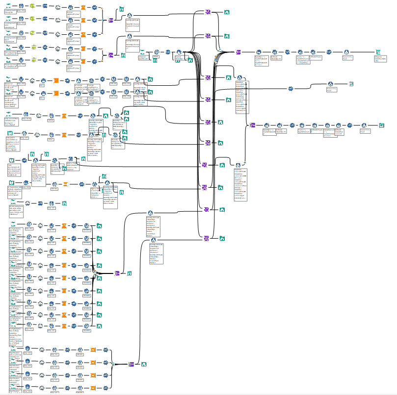
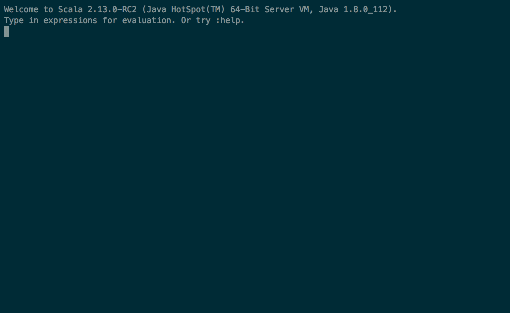
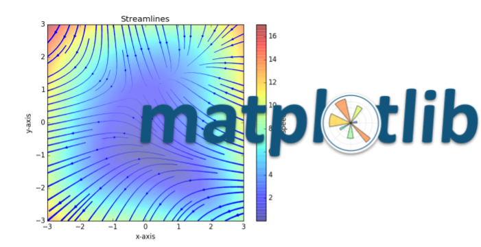
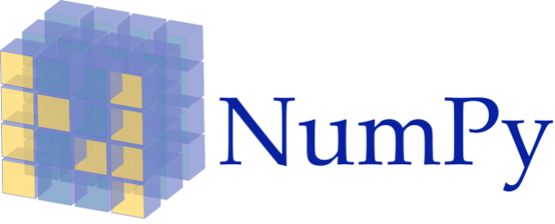
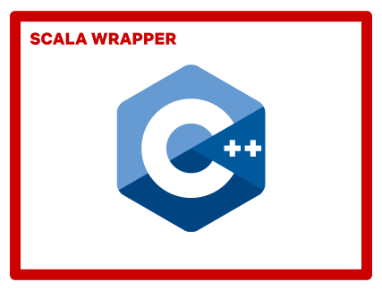

class: title

# Why Netflix ❤️s Scala<br /> for Machine Learning

### Aish Fention .social[ aishfenton<br /> aishfenton]
### Jeremy Smith .social[ jeremyrsmith<br /> gentleman-and-a-scala]

#### ScalaDays 2019

---
class: squeeze middle

# The dirty secret of ML research … 

---

class: full-image


---

class: middle center


---

class: middle center

# Why?

---

class: middle squeeze-right

# #1 Numbers Have Meaning (.red[but our types don't])

---

class: middle 



---

class: middle squeeze-right

# #2 Mathematics Is Generalizable (.red[but fast code isn't]) 

---

class: middle



---

class: middle squeeze-right

# #3 We Have To Trade Performance For Maintainability (.red[and we create a mess])

---

class: middle



---

class: middle squeeze-right

# #4 We Spend 80%<br />Of Our Time Gluing Bits Together (.red[and it creates 90% of our bugs])

---

class: middle



---

class: middle squeeze

# Scala's .red[type system] to the rescue!

---

class: middle squeeze

# Strategy: make the type system .red[work] for you...

---

class: middle squeeze-right

# ...by encoding .red[meaning] in types

---

# Some examples

* Schema types – assign meaning and reduce boilerplate
* Symbolic functions – reified polymorphic functions

--

These are made possible with .red[**implicits**] – your hook for putting the type system to work 

---

class: center, middle

# Schema types

---

# Schema types

When working with data transformation pipelines, it would be great to have some type safety.

```scala
def aggregateScores(df: DataFrame): DataFrame

aggregateScores(myData)
// Exception: Missing columns country, profile_id
```

--

But using exact types for every intermediate data shape would be a huge burden (there would be thousands of case classes!)

???

We also use complex nested schemas – case classes just wouldn't work.

--

Schema types are a simple middle ground.

---

# Schema types

Define some columns that we care about:

```
trait Col[Self] { self: Self => }

sealed trait VideoId extends Col[VideoId]
object VideoId extends VideoId

sealed trait Features extends Col[Features]
object Features extends Features

sealed trait Score extends Col[Score]
object Score extends Score

// etc
```

???

Just defining abstract bits of meaning

---

# Schema types

And give the dataset a phantom type describing them:

```scala
case class Dataset[Schema](df: DataFrame) {
  def validate[T <: Col[T]](
    col: Col[T],
    name: String
  ): Dataset[Schema with T] = ???
}
```

???

We have a validate method which does a check at runtime and tracks type info at runtime.

Several overloads of that for different arities, and with tuples.

---

class: biggish-code

# Schema types

Now we can put some type information onto the data while we check the schema:

```scala
val myData = Dataset(myDF).validate(
  VideoId -> "video_id",
  Country -> "country_code",
  ProfileId -> "profile_id",
  Score -> "score")

// myData: Dataset[VideoId with Country with ProfileId with Score]
```

???

We'll check those physical columns at runtime and track the schema type at compile time

--

(We'll have the wrapper store information about what's been validated at runtime as well)

???

There's no magic. Not connecting to DW at compile time or anything.
Still have to validate the schema explicitly. Just doing more with the boilerplate.

---

# Schema types

Now our functions can be a little more descriptive:

```scala
def aggregateScores[S <: Country with ProfileId with Score](
  data: Dataset[S]
): Dataset[S with AggregateScore] = ???
```

--

The intersection type does all the compile-time work – no shapeless needed!

```scala
val myData: Dataset[Country with Score] = ???

aggregateScores(myData)
// Nope - no ProfileId, compile time error!
```

???

Nothing against shapeless - but it's not even necessary here.

---

# Schema types

We can carry additional information in some `Col`s:

* Logic to validate Spark data type
* Type member to represent domain-level data type
* Logic to extract domain object from Spark representation

--

Our APIs can use this information to do more useful work from that single
`validate` call.

???

Feature generation – time-traveled context data for offline/online parity


---

# Schema types

We've also removed the hard-coded physical column names from the `aggregateScores` function.

It can ask the dataset for the name of the `ProfileId` column at runtime.

--

(It was provided when the user `validate`d the schema)

???

Using abstract bits of meaning and bringing them together to make nicer APIs

---

# Transform functions

We have a data type for these functions:

```scala
trait TransformFunction[In, Out] {
  def apply[S <: In](data: Dataset[S]): Dataset[S with Out]
  
  def andThen[In2, Out2]
    (next: TransformFunction[In2, Out2])
    (implicit c: SchemaComposition[In, Out, In2, Out2])
    : TransformFunction[c.CombinedIn, c.CombinedOut]
}
```

---

# Transform functions

We have a data type for these functions:

```scala
trait TransformFunction[In, Out] {
  def apply[S <: In](data: Dataset[S]): Dataset[S with Out]
  
  def andThen[In2, Out2]
    (next: TransformFunction[In2, Out2])
*   (implicit c: SchemaComposition[In, Out, In2, Out2])
    : TransformFunction[c.CombinedIn, c.CombinedOut]
}
```

--

This typeclass gives us the overall input and output schema for the composition.

???

This typeclass computes at the type level the input and output schemas of the composition.

---

# Example

```scala
val first: TransformFunction[A with B, C]
val second: TransformFunction[B with C with D, E with F]

first andThen second

// TransformFunction[A with B with D, C with E with F]
```

???

Note that the composition doesn't require C, since it's produced by the first function.

---

# Inferred transforms

```scala
class TransformFunction[In, Out] {
  // ...

  def adapted[S](implicit
*   adapt: AdaptTransform[In, S]
  ): adapt.Out
}
```

This typeclass will search for standard transform functions that can provide missing columns needed.

--

This can reduce a lot of boilerplate glue, while keeping functionality modular.

---

# Example

```scala
sealed trait B extends Col[B]
object B extends B {

  // given A and C, B can be derived with a known transform
  // which also provides a bonus E column
  implicit val provide: ColProvider[B, A with C, B with E]
  
}
```

```scala
val fn: TransformFunction[A with B with C, D]
val data: Dataset[A with C]

fn.adapted(data)
// Dataset[A with B with C with D with E]
```

???

And we do this recursively – with implicits we can eliminate large amounts of boilerplatey
compositions.

This lets us keep our transformations very modular without a burden on the user. Compiler does
the copy&paste for them.

If it can't resolve all the requirements, it will be a compile error.

---

# Compositional flavors

A `StateTransformFunction` can also emit a value in addition to the transformed dataset.

--

This leads to nice expression of pipelines.

```scala
for {
  stats   <- Stratify() if stats.error < 0.05
  _       <- GenerateFeatures()
  model   <- Train()
  _       <- Rank()
  metrics <- TestMetrics() if metrics.nmrr >= 0.2
} yield (stats, model, metrics)
```

---

class: center middle

# Symbolic functions

???

This is a perfect example of what I love about Scala's type system.

Most people are vaguely horrified by it

The takeaway is thinking about what problems can be solved by encoding
meaning into the type system

Hopefully there's > 20 mins left

---

# Symbolic functions

We like using polymorphic math functions, but there's usually some cost.

```scala
def logistic[T](x: T)(implicit trig: Trig[T]): T =
  trig.reciprocal(trig.one + trig.exp(trig.negate(x))) 
``` 

--

😀 It works on any type with a `Trig` algebra!<br />

--

🙁️ It's not too readable and it has performance implications due to boxing

--

Here's a fun idea – let's see where we can take it

---

# Expression DSL

```scala
trait ExprDSL[A] { self: A =>
  def +[B <: AnyVal](b: B): A + b.type = new +(this, b)
  def +[B <: ExprDSL[B]](b: B): A + B = new +(this, b)
  def *[B <: AnyVal](b: B): A * b.type = new *(this, b)
  def *[B <: ExprDSL[B]](b: B): A * b.type = new *(this, b)
  
  // etc
}

case class +[A, B](a: A, b: B) extends ExprDSL[A + B]
case class *[A, B](a: A, b: B) extends ExprDSL[A * B]
case class Arg[N <: Int](n: N) extends ExprDSL[Arg[N]]
// etc
```

???

A familiar idea, but notice the return types are specific rather than Expr

---

class: biggish-code

# Symbolic function

```scala
abstract class SymbolicFunction1[Expr[_]](expr: Expr[Arg[0]]) {
  def apply[A](a: A): Expr[A]
}

object SymbolicFunction1 {
  def apply[R](fn: Arg[0] => R)(
    implicit unapply: Unapply[R, Arg[0]]
  ): SymbolicFunction1[unapply.Out] = {
    val arg: Arg[0] = Arg(0)
    val r = fn(arg)
    new SymbolicFunction1(r) {
      def apply[A](a: A): unapply.Out[A] =
        unapply.reapply(r, arg)
    }
  }
}
```

---

class: biggish-code

# Symbolic function

```scala
abstract class SymbolicFunction1[Expr[_]](expr: Expr[Arg[0]]) {
  def apply[A](a: A): Expr[A]
}

object SymbolicFunction1 {
  def apply[R](fn: Arg[0] => R)(
*   implicit unapply: Unapply[R, Arg[0]]
  ): SymbolicFunction1[unapply.Out] = {
    val arg: Arg[0] = Arg(0)
    val r = fn(arg)
    new SymbolicFunction1(r) {
      def apply[A](a: A): unapply.Out[A] =
        unapply.reapply(r, arg)
    }
  }
}
```

???

Construct a symbolic function - give it an ordinary function (Arg is an Expr)
and it eta-expands at the type level.

---

class: smallish-code

# Example

```scala
scala> val logistic = SymbolicFunction1 {
     |   x => 1 / (1 + e^(-x)) 
     | }

logistic: SymbolicFunction1[[T]Int(1) + Exp[Int(-1) * T] ^ Int(-1)] =
          x => (1 + e⁻ˣ)⁻¹

```

--

The AST of the function is encoded into a recursive type.

???

This might seem completely insane, but really what better return type for
a function than exactly everything it does?

--

Which means we can do fun things with implicits!

---

class: smallish-code small-content

# Teach the compiler algebra!

Some rules for manipulating expressions:

```scala
trait Simplify[Expr] {
  type Out
}

object Simplify {
  type Aux[Expr, Out0] = Simplify { type Out = Out0 }
  
  // a base case
  implicit def arg[N <: Int]: Aux[Arg[N], Arg[N]] = ...
  
  // some recursive rules for simplifying expressions
  implicit def addId[A](implicit sa: Simplify[A]): Aux[A + 0, sa.Out] = ...
  implicit def mulId[A](implicit sa: Simplify[A]): Aux[A * 1, sa.Out] = ...
  implicit def mul0[A]: Aux[A * 0, 0] = ...
  implicit def powId[A](implicit sa: Simplify[A]): Aux[A ^ 1, sa.Out] = ...
  implicit def pow0[A]: Aux[A ^ 0, 1] = ...
  
  //etc
}

```

???

Just a few rules - there can be as many as we want.

---

```scala
object SymbolicFunction1 {
  def apply[R, S](fn: Arg[0] => R)(implicit
*   simplify: Simplify.Aux[R, S],
    unapply: Unapply[S, Arg[0]]
  ): SymbolicFunction1[unapply.Out] = ...
}
```

???

Back in the constructor, we'll first simplify the expression

--

```scala
scala> val test = SymbolicFunction1 { x => (x * 1) + 0 }

test: SymbolicFunction1[[T]T] = x => x
```

--

👍 It simplified away the trivial stuff.

---

class: smallish-code

# Teach the compiler calculus?

```scala
trait Derivative[Expr, X] {
  type Out
}

object Derivative {
  type Aux[Expr, X, Out0] = Derivative[Expr, X] { type Out = Out0 }
  
  implicit def x[X]: Aux[X, X, 1] = ...
  implicit def const[V <: AnyVal, X]: Aux[V, X, 0] = ...

  implicit def sum[A, B, X](implicit
    dA: Derivative[A, X],
    dB: Derivative[B, X]
  ): Aux[A + B, X, dA.Out + dB.Out] = ...
  
  implicit def product[A, B, X](implicit
    dA: Derivative[A, X],
    dB: Derivative[B, X]
  ): Aux[A * B, X, (dA.Out * B) + (A * dB.Out)] = ...
}

```

???

We'll have the chain rule, rules for trig and so forth

---

class: small-content smallish-code

# OK, a couple of macros

For some rules, we need to be able to manipulate those literal types. Macros to the rescue.

```
trait SubtractInt[A <: Int, B <: Int] {
  type Out <: Int
}

object SubtractInt {
  type Aux...
  implicit def materialize[A <: Int, B <: Int, Out <: Int]: Aux[A, B, Out] =
    macro SubtractIntMacros.materialize[A, B, Out]
}
``` 

--

(Macro implementation omitted – but this ought to be much easier in Dotty!)

---

class: biggish-code

# Power rule

```scala
implicit def power[X, P <: Int](implicit
   decrement: SubtractInt[P, 1]
): Aux[X^P, X, P * (X^(decrement.Out))] = ...
```

--

# Put it together

.contrast-code[
```scala
abstract class SymbolicFunction1[Expr[_]](expr: Expr[Arg[0]]) {
  def apply[A](a: A): Expr[A]
  
* def derivative[D, DS](implicit
*   dExpr: Derivative.Aux[Expr[Arg[0]], Arg[0], D],
*   simplify: Simplify.Aux[D, DS],
*   unapply: Unapply[DS, Arg[0]]
* ): SymbolicFunction1[unapply.Out] = ...
}
```
]

---

class: smallish-code

# It works!

```scala
scala> val logistic =  SymbolicFunction1 {
     |   x => 1 / (1 + e^(-x)) 
     | }

logistic: SymbolicFunction1[[T]Int(1) + Exp[Int(-1) * T] ^ Int(-1)] =
          x => (1 + e⁻ˣ)⁻¹
          
scala> logistic.derivative

res0: SymbolicFunction1[[T]Int(-1) * (Int(1) + Exp[Int(-1) * T] ^ Int(-2)) *
      (Int(-1) * Exp[Int(-1) * T])] =
      `x => (-(1 + e⁻ˣ)⁻² * -e⁻ˣ)`

```

--

👍 It found the derivative!

???

Note I didn't have a Simplify rule to cancel out the two negatives

---

# Reify

But how do I use it? Its `apply` just gives me an expression tree...

???

Which is good because I can call symbolic functions from within other symbolic functions
and have the combined expression in the output type

--

Let's turn it back into code, with some help from literal types again.

--

(We need a couple more macro type functions for literal string types. They're omitted, but use your imagination!)

---

class: smallish-code

# Reify

```scala
trait Reify[Expr, T] {
  type Code <: String
}

object Reify {
  type Aux...
  
  implicit def arg[N <: Int, NS <: String, T](implicit
    toStr: ToString: ToString.Aux[N, NS],
    concat: Concat[("x", NS)]
  ): Aux[Arg[N], T, concat.Out] = ... // i.e. "x0"
  
  implicit def const[V <: AnyVal : Numeric](implicit
    toStr: ToString[V]
  ): Aux[V, V, toStr.Out] = ...
  
  implicit def multiplyPrimitive[A, B, T <: AnyVal : Numeric](implicit
    reifyA: Reify[A, T], reifyB: Reify[B, T],
    concat: Concat[(reifyA.Out, " * ", reifyB.Out)]
  ): Aux[A * B, T, concat.Out] = ...
}
```

---
class: biggish-code
# Reify

`Reify` is kind of like our "algebra", but it just witnesses code reification for each operation over a given type.

```scala
scala> Reify[3 * (Arg[0] ^ 3) + Exp[Arg[0]], Double]

res0: Reify[...]{ type Code =
 String("3 * java.lang.Math.pow(x0, 3) + java.lang.Math.exp(x0)")
} = ...
```

--

With one more simple macro, the `Code` type of `Reify` can be turned into a specialized function.

---



---

# Other thoughts

* Happened all at compile time (contrast with staging mechanisms)
* Can trivially be extended to symbolic functions of more than one argument
* Can non-trivially be extended to vector functions. Compile-time gradients?
* Gives an opportunity to optimize for target type (still at compile time)
  * i.e. optimal series of BLAS operations

???

Zero cost? The value isn't even needed.

--

github.com/jeremyrsmith/baudrillard

---

class: squeeze middle

# .red[The takeaway]: What problems can you solve by moving more information to the type level?

???

Because your program is two programs. The compile-time program results in the runtime program.

And the more computation you can do once at compile time, the less you have to do many times at runtime.

---

class: squeeze middle

# .red[The takeaway]: What problems can you solve by moving more information to the type level?

???

Whatever crazy use case you have that Scala didn't even think of, you can make it happen,
wrap it in a nice API and have it seamlessly blend with your other components.

That's what we love about Scala. It gives you the power to do this.

---

# Coming soon to Scala 3

* Opaque types – give semantics to numbers without boxing
* Principled structural types – ad-hoc schemas without reflection (or boxing?)
* Cleaner metaprogramming – scrap your macros
* Cleaner dependent types – scrap your type parameters

???
Opaque types huge

More specific meaning without cost

More power with less heiroglyphics

Extra type parameters gone

--

More ways the type system can work for you...

--

More reasons to ❤️ Scala!

---

class: center, middle

# What's Still Missing?

---

class: center fit-image


???

Should we cryptically mention that "we're working on it"? ;)

---

class: center middle



???

Make a joke about Vegas :)

---

class: center middle



???

* Mention Breeze. And limitation with JNI issues, and lack of active development. 
* Also not good separation of concerns. 
* ND4J,S
* No standard. Lingua-franca.
* No idiomatic library for Scala.  

---

class: center middle



???

* GraalVM
* JEPs
    * JEP 218 – Value types (Valhalla).
    * JEP 338 – Vector intrinsics (Panama).
    * JEP 191 – Foreign Function Interface (also in Panama).
    * Could be a long wait. And both will need Scala support.
* JNI wrappers


---

class: center middle


---

class: center middle end-title

# Questions?

